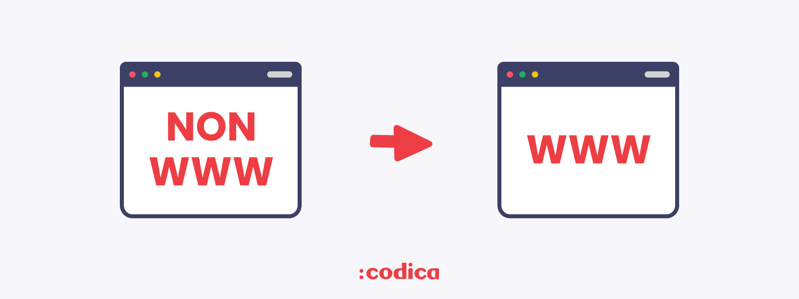
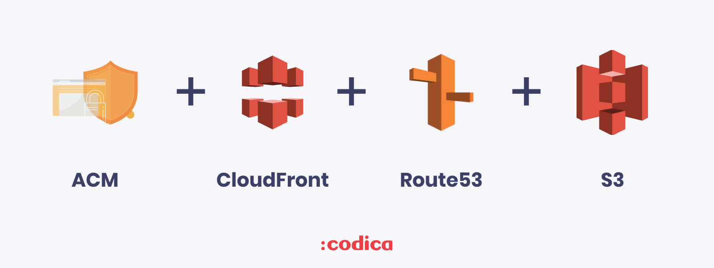
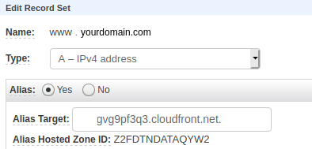
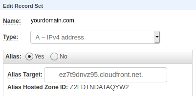

<h1 align="center">Redirect non-www to www with S3 and CloudFront</h1>

If you want to redirect (non-www to www) to your static website hosted on S3 and delivered by CloudFront, this guide is for you.

## Prerequisites

We will use such tools as:

* [Amazon S3](https://aws.amazon.com/s3/) 
* [Amazon Certificate Manager](https://aws.amazon.com/ru/certificate-manager/)
* [Amazon CloudFront](https://aws.amazon.com/ru/cloudfront/) 
* [Amazon Route53](https://aws.amazon.com/ru/route53/) 

## Prepare the S3 buckets 
At first, you need to create your S3 buckets. The main bucket name will be ``www.yourdomain.com``, the second one will be ``yourdomain.com``. When completed - upload static content to your main bucket, then complete static website hosting.

For ``yourdomain.com`` named bucket use these settings:

## Get certificates for your domain

Change your region to ``us-east-1`` and go to Amazon Certificate Manager, reqest certificates for your both domain names ``www.yourdomain.com``, ``yourdomain.com``. Don't forget to create CNAME records in Route53.
 
## Configuring CloudFront

After getting certificates, go to CloudFront and create two ditributions. For Origin Domain Name use the S3 endpoint, **don't use** autocompleted variant.

For Viewer Protocol Policy use Redirect HTTP to HTTPS.

.

CNAME for the main CloudFront distibution is going to be ``www.yourdomain.com`` with your www certificate. 

CNAME for second CloudFront distibution is going to be ``yourdomain.com`` with your non-www certificate.

Disable CloudFront caching.

## Configuring Route53

For ``www.yourdomain.com`` create A record with alias to CloudFront address according to www domain.

For ``yourdomain.com`` create A record with alias to CloudFront address according to non-www domain.

## License
Copyright © 2015-2020 Codica. It is released under the [MIT License](https://opensource.org/licenses/MIT).

## About Codica

The names and logos for Codica are trademarks of Codica.

We love open source software! See [our other projects](https://github.com/codica2) or [hire us](https://www.codica.com/) to design, develop, and grow your product.
