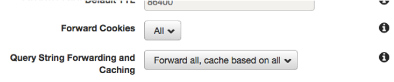

<h1 align="center">Redirect non-www to www with S3 and CloudFront</h1>

If you want to redirect (non-www to www) on your static website hosted on S3 and delivered by CloudFront this guide is for you.

## Prerequisites

We will use such tools as:

* [Amazon S3](https://aws.amazon.com/s3/) 
* [Amazon Certificate Manager](https://aws.amazon.com/ru/certificate-manager/)
* [Amazon CloudFront](https://aws.amazon.com/ru/cloudfront/) 
* [Amazon Route53](https://aws.amazon.com/ru/route53/) 

## Prepare the S3 buckets 
At first you need to create your S3 buckets. Main bucket name will be ``www.yourdomain.com``, second one is ``yourdomain.com``. When completed - upload static content to your main bucket, then complete static website hosting.

For ``yourdomain.com`` named bucket use these settings:

## Get certificates for your domain

Change your region to ``us-east-1`` and go to Amazon Certificate Manager, reqest certificates for your both domain names ``www.yourdomain.com``, ``yourdomain.com``. Dont forget to create CNAME records in Route53.
 
## Configuring CloudFront

After getting certifactes go to CloudFront and create two ditribuitions. For Origin Domain Name use the s3 endpoint, dont use autocompleted variant. 
For Viewer Protocol Policy use Redirect HTTP to HTTPS .

.

CNAME for main CloudFront distibution is going to be www.yourdomain.com with your www certificate 

CNAME for secon CloudFront distibution is going to be yourdomain.com with your non-www certificate 

Disable CloudFront caching

